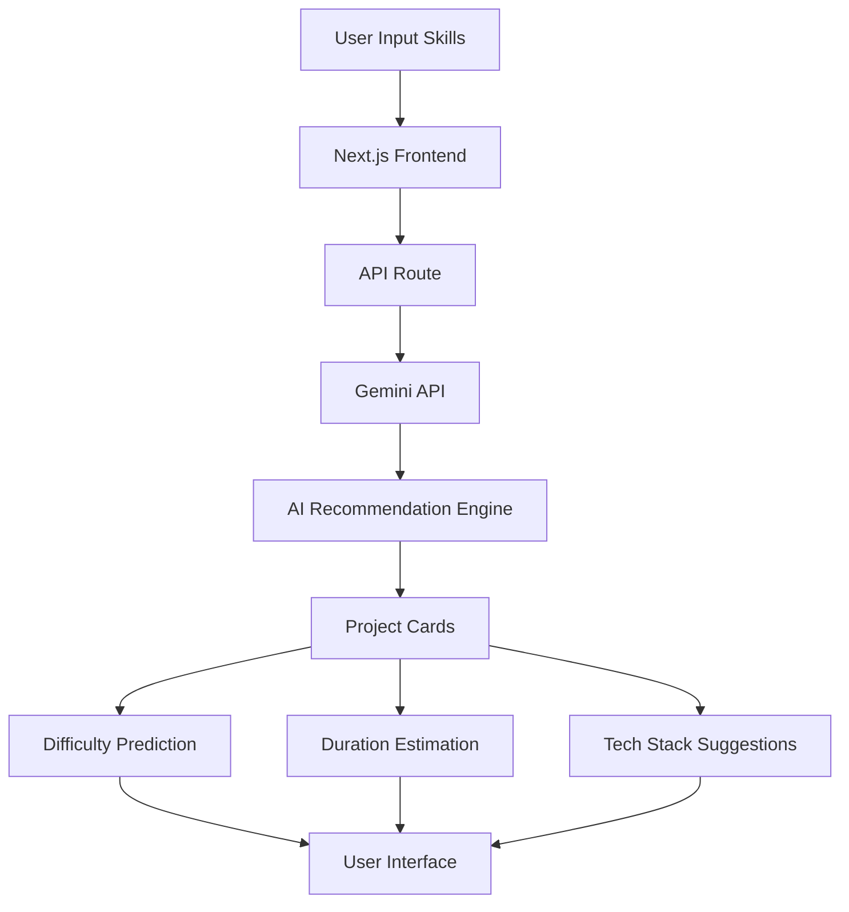
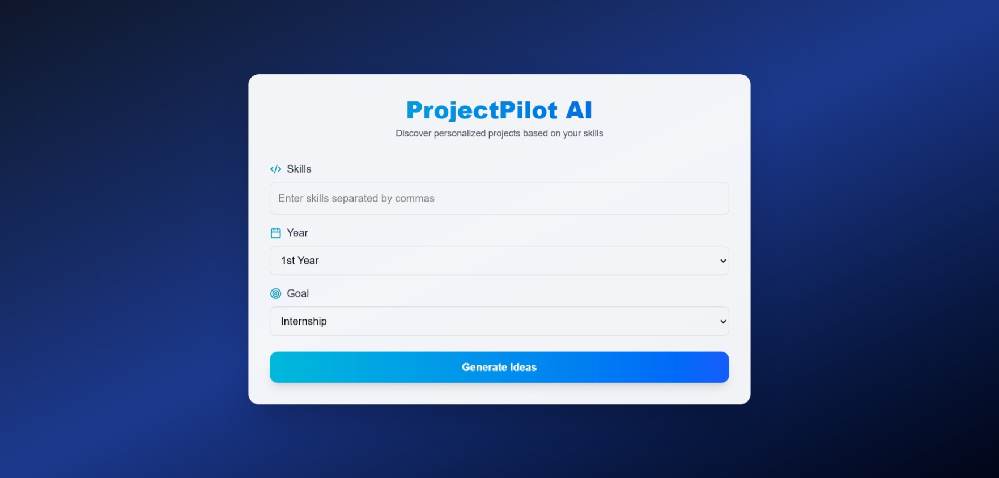
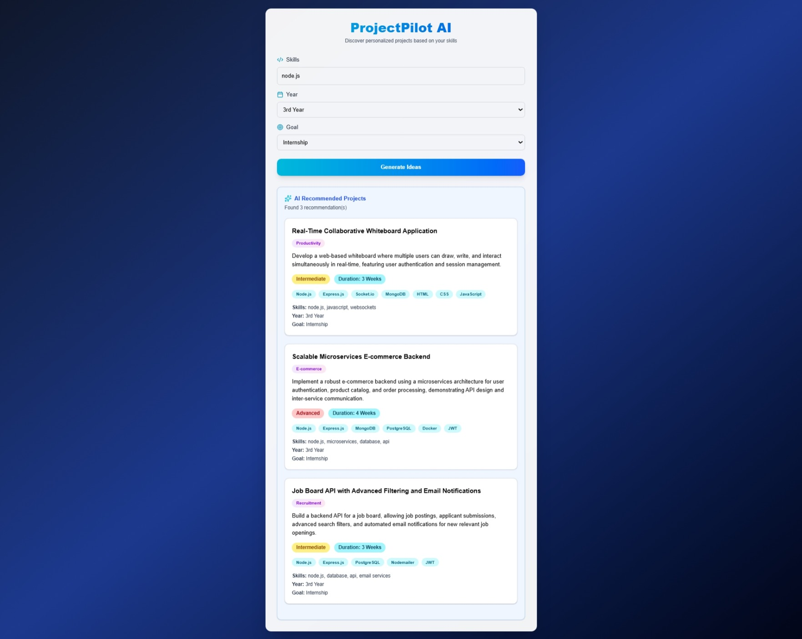

# 🚀 ProjectPilot AI

AI-powered platform that generates personalized project ideas using Google's Gemini API.


## 🌐 Live Demo

https://projectpilot-ai-self.vercel.app

---
## 🏗️ Architecture


---
## ✨ Features

- AI-powered project recommendations
- Personalized suggestions
- Internship-focused ideas
- Difficulty prediction
- Duration estimation
- Recommended tech stack
- Responsive design
- Gemini 2.5 Flash integration
---

## 🛠 Tech Stack

- Next.js
- TypeScript
- Tailwind CSS
- Gemini API
- Google GenAI SDK
- Vercel

---
## 📸 Project Preview

### 🏠 Home Screen


---

### 🤖 AI Recommendations


---

🌐 Live Demo

[Visit ProjectPilot AI](https://projectpilot-ai-self.vercel.app)

---

## ⚙️ Installation

```bash
git clone https://github.com/chethuchethana2006-ops/projectpilot-ai.git

cd projectpilot-ai

npm install

npm run dev
```

---
## 🔑 Environment Variables

Create:

```env
GEMINI_API_KEY=your_key_here
```

---
## 🚀 Deployment

Hosted on Vercel

https://projectpilot-ai-self.vercel.app

---

## 👩‍💻 Author

Chethana M M

Computer Science Student

CMR University
